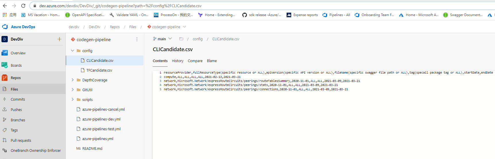
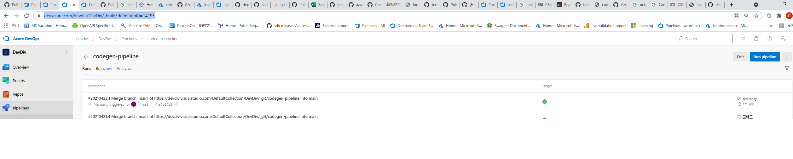
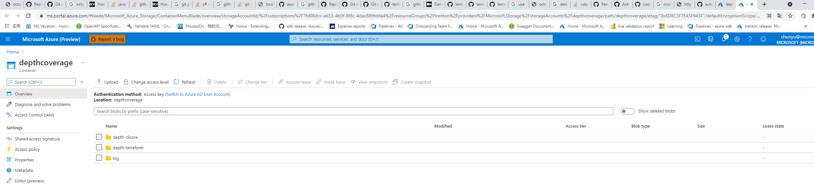

# Overview
Depth-coverage pipeline is to help on automatically generate Azure CLI commands or Terraform provider code to achieve 100% depth coverage. It will be scheduled trigged to retrieve missing operations/resources from Coverage-Result report DB and automatically generate Azure CLI commands/Terraform resources which can be used by CLI/Terraform team to onboard them.
There are two separated pipeline:
## Codegen controller pipeline ##
Codegen controller pipeline is the interface of the whole framework. It will accept request and trigger code generation pipeline. Also, it will provide the service onboarding report to customer. Codegen controller pipeline is scheduled to run
## Code generate pipeline ##
Code generate pipeline will be triggered by controller pipeline via repo Pull Request. It is responsible for generation code and validate service and generated code. Each codegen pipeline runtime instance is responsible for one RP.
# How to Use #

## Setup ##
By default the depth-coverage will try to trigger pipelines for all missing resources/operations at once. You can set candidate resources manually. If the candicates are set, only trigger pipelines for those candidates to generate missing operations or resources.
### candidate setting ###
configure candidates in CLICandidate.csv(for cli) and TFCandidate.csv(for terraform)  https://dev.azure.com/devdiv/DevDiv/_git/codegen-pipeline?path=%2Fconfig

Edit these two csv files directly to add/remove candidates for cli/terraform.
## Trigger depth-coverage ##
Codegen controller pipeline (codegen-pipeline, https://dev.azure.com/devdiv/DevDiv/_build?definitionId=14195 ) is to trigger depth-coverage. It is is scheduled to run once every week by default. You can manual trigger it if needed.

After trigger depth-coverage, each code generation pipeline will be trigger for each candidate resource provider to generate. And code generation pipeline will automatically generates code, compile, run mock test and live test. When failure occur or pipeline completed, email will be sent to you to ask your interaction.

### Failure Alert email ###

### Onboarding confirm email ###
## Customize ##
## Failure resolve ##
## storage blob ##
The generated code and logs are stored in Azure stroage blob: depthcoverage/depthcoverage

https://ms.portal.azure.com/#blade/Microsoft_Azure_Storage/ContainerMenuBlade/overview/storageAccountId/%2Fsubscriptions%2F7fd08dcc-a653-4b0f-8f8c-4dac889fdda4%2FresourceGroups%2Ftrenton%2Fproviders%2FMicrosoft.Storage%2FstorageAccounts%2Fdepthcoverage/path/depthcoverage/etag/%220x8D8C3F7E45F943F%22/defaultEncryptionScope/%24account-encryption-key/denyEncryptionScopeOverride//defaultId//publicAccessVal/Container

<li>depth-clicore: store cli-core code</li>
<li>depth-terraform: store terraform code</li>
<li>logs: store all the pipeline running logs. each pipeline has a log folder with the pipeline build id as folder name. </li>
### generated code ###
### logs ###